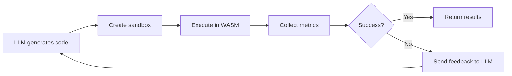

├── workspace/                   # Isolated filesystem (mounted as /app)
│   └── <session-id>/            # Per-session workspaces
├── vendor/                      # Vendored pure-Python packages
│   └── site-packages/
├── demo.py                      # Comprehensive feature demo
├── pyproject.toml               # Project metadata & dependencies
└── README.md                    # This file
```

---

## 🤖 LLM Integration

### Integration Flow

Typical usage in an LLM code generation pipeline:



### Example Integration

```python
from sandbox import create_sandbox, ExecutionPolicy, RuntimeType

def execute_llm_code(llm_generated_code: str) -> dict:
    """Execute LLM-generated code with safety boundaries."""
    
    # Configure conservative limits for LLM code
    policy = ExecutionPolicy(
        fuel_budget=500_000_000,      # Fail fast on complex code
        memory_bytes=32 * 1024 * 1024,  # 32 MB limit
        stdout_max_bytes=100_000        # 100 KB output
    )
    
    sandbox = create_sandbox(runtime=RuntimeType.PYTHON, policy=policy)
    result = sandbox.execute(llm_generated_code)
    
    # Provide structured feedback for LLM
    if not result.success:
        return {
            "status": "error",
            "feedback": f"Execution failed: {result.stderr}",
            "suggestion": "Simplify the code and avoid complex operations"
        }
    
    if result.fuel_consumed > 400_000_000:
        return {
            "status": "warning",
            "feedback": "Code complexity too high",
            "fuel_used": result.fuel_consumed,
            "suggestion": "Optimize algorithm for better efficiency"
        }
    
    return {
        "status": "success",
        "output": result.stdout,
        "metrics": {
            "fuel": result.fuel_consumed,
            "duration": result.duration_seconds,
            "memory_pages": result.mem_pages
        }
    }

# Use in LLM loop
code = generate_code_from_llm("Calculate fibonacci(10)")
feedback = execute_llm_code(code)
print(feedback)
```

### Multi-Turn Sessions

For stateful LLM interactions with file persistence:

```python
from sandbox import create_sandbox, RuntimeType

# Turn 1: LLM creates data file
sandbox = create_sandbox(runtime=RuntimeType.PYTHON)
session_id = sandbox.session_id

result1 = sandbox.execute("""
import json
data = {"users": ["Alice", "Bob"], "count": 2}
with open('/app/data.json', 'w') as f:
    json.dump(data, f)
print("Data saved")
""")

# Turn 2: LLM reads and processes data (same session)
sandbox = create_sandbox(session_id=session_id, runtime=RuntimeType.PYTHON)

result2 = sandbox.execute("""
import json
with open('/app/data.json', 'r') as f:
    data = json.load(f)
data['users'].append('Charlie')
data['count'] = len(data['users'])
print(f"Updated: {data}")
""")

print(result2.stdout)  # "Updated: {'users': ['Alice', 'Bob', 'Charlie'], 'count': 3}"
```

Session workspaces are canonicalized before creation (no `/`, `\\`, or `..` in
IDs) and you can enforce UUID-only IDs via `allow_non_uuid=False`. Vendored
packages are copied per-session so one guest cannot poison another, optional
`mount_data_dir` mounts are read-only, and host-side logs are cleaned up unless
you opt in with `ExecutionPolicy(preserve_logs=True)`.

---

## 🔒 Security Model

### Multi-Layered Defense

This sandbox implements defense-in-depth with multiple security boundaries:

#### 1. **WASM Memory Safety**
- Bounds-checked linear memory (no buffer overflows)
- Validated control flow (no arbitrary jumps)
- Type-safe execution (strong typing enforced)

#### 2. **WASI Capability-Based I/O**
- **Preopens only**: File access limited to explicitly granted directories
- **No path traversal**: `..` and absolute paths outside capabilities are denied
- **Descriptor-based**: All I/O goes through validated capability descriptors

#### 3. **Deterministic Execution Limits**
- **Fuel metering**: Instruction-count budgets enforce hard time limits
- **OutOfFuel trap**: Exhausted budget triggers immediate termination
- **No runaway loops**: Infinite loops hit fuel limit automatically

#### 4. **Resource Caps**
- **Memory limit**: WASM linear memory capped at configured size
- **Output limits**: Stdout/stderr truncated to prevent DoS
- **No networking**: Zero network capabilities (no sockets)
- **No subprocesses**: Cannot spawn child processes

### Security Boundaries

| Boundary | Mechanism | Protection |
|----------|-----------|------------|
| **Memory** | WASM bounds checking | Prevents buffer overflows, use-after-free |
| **Filesystem** | WASI preopens | Restricts access to mounted directories only |
| **CPU** | Fuel metering | Prevents infinite loops, excessive computation |
| **I/O** | Capability descriptors | No ambient authority, explicit grants |
| **Environment** | Variable whitelist | Prevents info leaks, credentials exposure |

### Production Hardening

For production deployments, combine with OS-level security:

```python
import subprocess
import signal
from pathlib import Path

def execute_with_timeout(code: str, timeout_seconds: int = 30):
    """Execute sandbox in separate process with OS timeout."""
    
    script = f"""
from sandbox import create_sandbox, RuntimeType
sandbox = create_sandbox(runtime=RuntimeType.PYTHON)
result = sandbox.execute({code!r})
print(result.stdout)
"""
    
    try:
        result = subprocess.run(
            ["python", "-c", script],
            timeout=timeout_seconds,
            capture_output=True,
            text=True
        )
        return result.stdout
    except subprocess.TimeoutExpired:
        return "Execution timeout (OS limit)"
```

### Additional Recommendations

- 🐳 **Containers**: Run sandbox in Docker/Podman for additional isolation
- 📦 **cgroups**: Use Linux cgroups for CPU/memory limits
- 📊 **Monitoring**: Log all executions with code hashes for audit trails
- ⏱️ **OS Timeouts**: Combine fuel limits with OS-level process timeouts
- 🔐 **Network Isolation**: Deploy in network-restricted environments

---

## 🔧 Troubleshooting

### Common Issues

<details>
<summary><b>🚨 <code>python.wasm not found</code></b></summary>

**Solution:** Download the WASM binary
```powershell
.\scripts\fetch_wlr_python.ps1
```

**Verify:** Check that `bin/python.wasm` exists and is ~50-100 MB

</details>

<details>
<summary><b>🚨 <code>ImportError: wasmtime could not be imported</code></b></summary>

**Solution:** Install dependencies
```powershell
uv sync
# OR
pip install -r requirements.txt
```

**Verify:** `python -c "import wasmtime; print(wasmtime.__version__)"`

</details>

<details>
<summary><b>🚨 <code>OutOfFuel</code> trap during execution</b></summary>

**Cause:** Code exceeded instruction budget

**Solution:** Increase fuel budget or simplify code
```python
policy = ExecutionPolicy(fuel_budget=5_000_000_000)  # Increase limit
sandbox = create_sandbox(runtime=RuntimeType.PYTHON, policy=policy)
```

</details>

<details>
<summary><b>🚨 Memory limit errors</b></summary>

**Cause:** WASM memory cap exceeded

**Solution:** Increase memory limit
```python
policy = ExecutionPolicy(memory_bytes=256 * 1024 * 1024)  # 256 MB
sandbox = create_sandbox(runtime=RuntimeType.PYTHON, policy=policy)
```

</details>

<details>
<summary><b>🚨 <code>FileNotFoundError</code> in guest code</b></summary>

**Cause:** Path outside preopened directories

**Solution:** Use `/app` prefix for all file operations
```python
# ❌ Wrong
open('data.txt', 'r')

# ✅ Correct
open('/app/data.txt', 'r')
```

</details>

<details>
<summary><b>🚨 <code>ModuleNotFoundError</code> for package</b></summary>

**Cause:** Package not vendored or not in sys.path

**Solution:** Vendor pure-Python package
```powershell
uv run python scripts/manage_vendor.py install <package-name>
uv run python scripts/manage_vendor.py copy
```

Then in sandboxed code:
```python
import sys
sys.path.insert(0, '/app/site-packages')
import <package-name>
```

</details>

### Getting Help

- 🐞 **Report bugs**: [GitHub Issues](https://github.danskenet.net/e29667/llm-wasm-sandbox/issues)
- 📖 **Documentation**: See inline code comments and docstrings
- 💡 **Examples**: Check `demo.py` and `tests/` directory

---

## 🛠️ Development

### Running Tests

```powershell
# Run all tests with coverage
uv run pytest tests/ -v --cov=sandbox --cov-report=html

# Run specific test file
uv run pytest tests/test_python_sandbox.py -v

# Run tests matching pattern
uv run pytest tests/ -k "session" -v
```

### Code Quality

```powershell
# Type checking
uv run mypy sandbox/

# Linting and formatting
uv run ruff check sandbox/
uv run ruff format sandbox/
```

### Benchmarking

```powershell
# Performance benchmarks
uv run python benchmark_performance.py

# Session performance
uv run python benchmark_session_performance.py
```

---

## 🤝 Contributing

Contributions are welcome! Please follow these guidelines:

1. **Fork** the repository
2. **Create** a feature branch (`git checkout -b feature/amazing-feature`)
3. **Commit** your changes (`git commit -m 'Add amazing feature'`)
4. **Push** to the branch (`git push origin feature/amazing-feature`)
5. **Open** a Pull Request

### Development Setup

```powershell
# Clone your fork
git clone https://github.danskenet.net/YOUR-USERNAME/llm-wasm-sandbox.git
cd llm-wasm-sandbox

# Install dev dependencies
uv sync

# Run tests to verify setup
uv run pytest tests/ -v
```

---

## 📝 License

This project is licensed under the MIT License - see the [LICENSE](LICENSE) file for details.

---

## 🔗 References & Resources

- **Wasmtime Security**: https://docs.wasmtime.dev/security.html
- **WASI Capabilities**: https://github.com/bytecodealliance/wasmtime/blob/main/docs/WASI-capabilities.md
- **WebAssembly Language Runtimes**: https://github.com/webassemblylabs/webassembly-language-runtimes
- **Wasmtime Python Bindings**: https://github.com/bytecodealliance/wasmtime-py
- **WASI Specification**: https://github.com/WebAssembly/WASI

---

## 🚀 Roadmap

- [x] JavaScript runtime support (QuickJS WASM)
- [ ] Improved async execution support
- [ ] Network sandboxing with explicit socket grants
- [ ] Enhanced metrics and profiling
- [ ] Plugin system for custom runtimes
- [ ] Web-based demo interface

---

## ⭐ Star History

If you find this project useful, please consider giving it a star on GitHub!

---

<div align="center">

**Built with ❤️ for secure LLM code execution**

[Report Bug](https://github.danskenet.net/e29667/llm-wasm-sandbox/issues) •
[Request Feature](https://github.danskenet.net/e29667/llm-wasm-sandbox/issues) •
[Documentation](https://github.danskenet.net/e29667/llm-wasm-sandbox)

</div>
