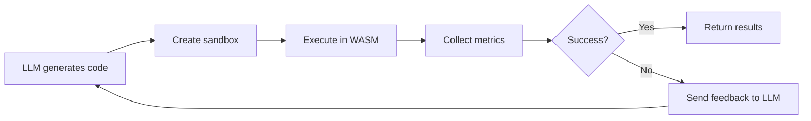

<div align="center">

# 🔒 LLM WASM Sandbox

**Production-grade security sandbox for executing untrusted Python & JavaScript code generated by LLMs**

[](https://www.python.org/downloads/)
[](https://opensource.org/licenses/MIT)
[](https://github.com/bytecodealliance/wasmtime-py)

Execute untrusted code safely using WebAssembly sandboxing with multi-layered security:

🔐 **WASM Memory Safety** - Bounds-checked execution  
🛡️ **WASI Capability-Based I/O** - Filesystem isolation  
⏱️ **Deterministic Limits** - Fuel metering & resource caps  
🐍 **Python & JavaScript** - CPython WASM + QuickJS runtimes

</div>

---

## 📋 Table of Contents

- [Features](#-features)
- [Quick Start](#-quick-start)
- [Architecture](#-architecture)
- [LLM Integration](#-llm-integration)
- [MCP Integration](#-mcp-integration)
- [Security Model](#-security-model)
- [Troubleshooting](#-troubleshooting)
- [Development](#️-development)
- [Contributing](#-contributing)
- [License](#-license)

---

## ✨ Features

- **🔒 Production-Grade Security**: Multi-layered defense with WASM memory safety, WASI capabilities, and resource limits
- **🐍 Python Runtime**: CPython 3.11 compiled to WASM via WebAssembly Language Runtimes
- **📜 JavaScript Runtime**: QuickJS-NG WASM for secure JavaScript execution
- **📦 Bundled Runtimes**: WASM binaries included in package - no separate downloads needed
- **⚡ Deterministic Execution**: Fuel-based instruction counting prevents runaway code
- **📦 Package Vendoring**: Pure-Python packages available in sandbox via `vendor/` directory
- **💾 Persistent Sessions**: UUID-based session IDs with automatic workspace isolation
- **🗂️ Pluggable Storage**: Storage adapter interface with disk and custom backend support
- **📊 Rich Metrics**: Fuel consumption, memory usage, execution time tracking
- **🎯 Type-Safe API**: Pydantic models for policies and results
- **🔍 Structured Logging**: Observable execution events for monitoring
- **🧹 Session Pruning**: Automatic cleanup of old sessions with configurable retention policies
- **💡 Actionable Error Guidance**: Structured error analysis with concrete solutions for common failures
- **📈 Proactive Fuel Analysis**: Automatic budget monitoring with recommendations to prevent OutOfFuel errors


---

## 🚀 Quick Start

### Prerequisites

- Python 3.11+ (Python 3.13+ recommended)
- [uv](https://docs.astral.sh/uv/) package manager (recommended) or pip
- Windows, macOS, or Linux

### Installation

#### From PyPI (Recommended)

```bash
# Install the package (includes WASM runtimes)
pip install llm-wasm-sandbox

# That's it! The WASM runtimes (python.wasm and quickjs.wasm) are bundled automatically.
```

#### From Source

```powershell
# Clone the repository
git clone https://github.com/ThomasRohde/llm-wasm-sandbox.git
cd llm-wasm-sandbox

# Install dependencies (uv recommended)
uv sync
# OR with pip
pip install -r requirements.txt

# Download WASM runtimes (required for development)
.\scripts\fetch_wlr_python.ps1   # CPython WASM binary
.\scripts\fetch_quickjs.ps1       # QuickJS WASM binary
```

### Hello World

**Python Runtime:**
```python
from sandbox import create_sandbox, RuntimeType

sandbox = create_sandbox(runtime=RuntimeType.PYTHON)
result = sandbox.execute("print('Hello from WASM!')")
print(result.stdout)  # "Hello from WASM!"
```

**JavaScript Runtime:**
```python
from sandbox import create_sandbox, RuntimeType

sandbox = create_sandbox(runtime=RuntimeType.JAVASCRIPT)
result = sandbox.execute("console.log('Hello from QuickJS!')")
print(result.stdout)  # "Hello from QuickJS!"
```

**Stateful Sessions with Automatic Variable Persistence (Python only):**
```python
from sandbox import create_sandbox, RuntimeType

# Create session with auto-persist enabled (Python runtime only)
sandbox = create_sandbox(runtime=RuntimeType.PYTHON, auto_persist_globals=True)

# First execution - set variables
sandbox.execute("counter = 100; data = [1, 2, 3]")

# Second execution - variables automatically restored!
sandbox.execute("print(f'counter={counter}, data={data}')")
# Output: counter=100, data=[1, 2, 3]

# ✅ JavaScript runtime also supports auto_persist_globals!
# See examples/demo_javascript_stateful.py for JavaScript examples.
```

### Run Demo

```powershell
# Python demo with comprehensive examples
uv run python examples/demo.py

# JavaScript demo (single execution)
uv run python examples/demo_javascript.py

# JavaScript session demo (stateful execution)
uv run python examples/demo_javascript_session.py

# Session workflow demo (file operations)
uv run python examples/demo_session_workflow.py
```

---

## 🏗️ Architecture

### Project Structure

```
llm-wasm-sandbox/
├── bin/
│   ├── python.wasm               # CPython WASM binary (bundled with package)
│   └── quickjs.wasm              # QuickJS WASM binary (bundled with package)
├── config/
│   └── policy.toml               # Execution policy configuration
├── sandbox/
│   ├── core/                     # Type-safe foundation
│   │   ├── models.py             # ExecutionPolicy, SandboxResult, RuntimeType
│   │   ├── base.py               # BaseSandbox ABC
│   │   ├── errors.py             # Custom exceptions
│   │   ├── logging.py            # Structured logging
│   │   ├── factory.py            # create_sandbox() factory
│   │   └── storage.py            # Storage adapter interface
│   ├── runtimes/                 # Runtime implementations
│   │   ├── python/
│   │   │   └── sandbox.py        # PythonSandbox
│   │   └── javascript/
│   │       └── sandbox.py        # JavaScriptSandbox
│   ├── host.py                   # Wasmtime/WASI wrapper
│   ├── policies.py               # Policy loading
│   ├── sessions.py               # Session file operations & pruning
│   ├── utils.py                  # Utilities
│   └── vendor.py                 # Package vendoring
├── mcp_server/                  # MCP server implementation
│   ├── server.py                 # FastMCP server
│   ├── sessions.py               # Workspace session manager
│   ├── tools.py                  # MCP tool definitions
│   ├── transports.py             # Stdio/HTTP transports
│   └── config.py                 # MCP configuration
├── workspace/                   # Isolated filesystem (mounted as /app)
│   └── <session-id>/            # Per-session workspaces
├── vendor/                      # Vendored pure-Python packages
│   └── site-packages/
├── examples/                    # Demo scripts and examples
│   ├── demo.py                  # Comprehensive feature demo
│   ├── demo_javascript.py       # JavaScript runtime demo
│   ├── demo_javascript_session.py # JavaScript session demo
│   ├── demo_session_workflow.py # Session workflow demo
│   └── openai_agents/           # OpenAI Agents SDK integrations
├── pyproject.toml               # Project metadata & dependencies
└── README.md                    # This file
```

---

## 🤖 LLM Integration

### Integration Flow

Typical usage in an LLM code generation pipeline:



### Example Integration

```python
from sandbox import create_sandbox, ExecutionPolicy, RuntimeType

def execute_llm_code(llm_generated_code: str) -> dict:
    """Execute LLM-generated code with safety boundaries."""
    
    # Configure conservative limits for LLM code
    policy = ExecutionPolicy(
        fuel_budget=500_000_000,      # Fail fast on complex code
        memory_bytes=32 * 1024 * 1024,  # 32 MB limit
        stdout_max_bytes=100_000        # 100 KB output
    )
    
    sandbox = create_sandbox(runtime=RuntimeType.PYTHON, policy=policy)
    result = sandbox.execute(llm_generated_code)
    
    # Use structured error guidance for actionable feedback
    if not result.success:
        error_guidance = result.metadata.get("error_guidance", {})
        return {
            "status": "error",
            "feedback": f"Execution failed: {result.stderr}",
            "error_type": error_guidance.get("error_type", "Unknown"),
            "solutions": error_guidance.get("actionable_guidance", []),
            "related_docs": error_guidance.get("related_docs", [])
        }
    
    # Use fuel analysis for proactive budget recommendations
    fuel_analysis = result.metadata.get("fuel_analysis", {})
    if fuel_analysis.get("status") in ("warning", "critical"):
        return {
            "status": "warning",
            "feedback": fuel_analysis.get("recommendation", "Code complexity high"),
            "fuel_used": result.fuel_consumed,
            "suggested_budget": fuel_analysis.get("suggested_budget")
        }
    
    return {
        "status": "success",
        "output": result.stdout,
        "metrics": {
            "fuel": result.fuel_consumed,
            "duration": result.duration_seconds,
            "memory_pages": result.mem_pages
        }
    }

# Use in LLM loop
code = generate_code_from_llm("Calculate fibonacci(10)")
feedback = execute_llm_code(code)
print(feedback)
```

### Error Guidance & Fuel Analysis

The sandbox automatically provides structured error analysis and fuel budget recommendations:

**Error Guidance** (`result.metadata["error_guidance"]`):
```python
# When execution fails, get actionable solutions
result = sandbox.execute("import nonexistent_package")

if "error_guidance" in result.metadata:
    guidance = result.metadata["error_guidance"]
    print(f"Error Type: {guidance['error_type']}")  # e.g., "MissingVendoredPackage"
    for solution in guidance["actionable_guidance"]:
        print(f"  - {solution}")
    # Output: 
    #   - Add: import sys; sys.path.insert(0, '/data/site-packages')
    #   - Then import vendored packages normally
```

**Fuel Analysis** (`result.metadata["fuel_analysis"]`):
```python
# Monitor fuel usage to prevent OutOfFuel errors
result = sandbox.execute("import openpyxl; wb = openpyxl.Workbook()")

analysis = result.metadata.get("fuel_analysis", {})
print(f"Status: {analysis['status']}")           # efficient/moderate/warning/critical
print(f"Utilization: {analysis['utilization_percent']:.1f}%")
print(f"Recommendation: {analysis['recommendation']}")
# Output:
#   Status: warning
#   Utilization: 82.5%
#   Recommendation: Consider increasing fuel budget to 15B for similar workloads
```

For detailed error types and fuel planning, see:
- [`docs/ERROR_GUIDANCE.md`](docs/ERROR_GUIDANCE.md) - Complete error catalog with solutions
- [`docs/FUEL_BUDGETING.md`](docs/FUEL_BUDGETING.md) - Fuel budget planning guide

### Multi-Turn Sessions

**Option 1: Automatic Global Variable Persistence** (Recommended)

```python
from sandbox import create_sandbox, RuntimeType

# Create session with auto-persist enabled
sandbox = create_sandbox(runtime=RuntimeType.PYTHON, auto_persist_globals=True)

# Turn 1: LLM sets variables (no manual save/load needed!)
result1 = sandbox.execute("""
users = ["Alice", "Bob"]
count = len(users)
print(f"Initialized: {users}")
""")

# Turn 2: Variables automatically restored
result2 = sandbox.execute("""
users.append("Charlie")
count = len(users)
print(f"Updated: {users}, count={count}")
""")
# Output: Updated: ['Alice', 'Bob', 'Charlie'], count=3
```

**Option 2: Manual File Persistence**

For complex data structures or explicit control:

```python
from sandbox import create_sandbox, RuntimeType

# Turn 1: LLM creates data file
sandbox = create_sandbox(runtime=RuntimeType.PYTHON)
session_id = sandbox.session_id

result1 = sandbox.execute("""
import json
data = {"users": ["Alice", "Bob"], "count": 2}
with open('/app/data.json', 'w') as f:
    json.dump(data, f)
print("Data saved")
""")

# Turn 2: LLM reads and processes data (same session)
sandbox = create_sandbox(session_id=session_id, runtime=RuntimeType.PYTHON)

result2 = sandbox.execute("""
import json
with open('/app/data.json', 'r') as f:
    data = json.load(f)
data['users'].append('Charlie')
data['count'] = len(data['users'])
print(f"Updated: {data}")
""")

print(result2.stdout)  # "Updated: {'users': ['Alice', 'Bob', 'Charlie'], 'count': 3}"
```

Session workspaces are canonicalized before creation (no `/`, `\\`, or `..` in
IDs) and you can enforce UUID-only IDs via `allow_non_uuid=False`. Vendored
packages are mounted read-only at `/data/site-packages` (shared across all sessions
for efficiency), optional `mount_data_dir` mounts are also read-only, and host-side
logs are cleaned up unless you opt in with `ExecutionPolicy(preserve_logs=True)`.

### Session Management API

Direct session file operations and pruning:

```python
from sandbox import (
    create_sandbox, RuntimeType,
    write_session_file, read_session_file, list_session_files,
    prune_sessions, delete_session_workspace
)

# Create sandbox and write files
sandbox = create_sandbox(runtime=RuntimeType.PYTHON)
write_session_file(sandbox.session_id, "data.json", '{"key": "value"}')

# List all files in session
files = list_session_files(sandbox.session_id)
print(files)  # ['data.json', 'user_code.py']

# Read file content
content = read_session_file(sandbox.session_id, "data.json")

# Prune old sessions (e.g., older than 7 days)
result = prune_sessions(max_age_days=7)
print(f"Deleted {result.deleted_count} sessions, freed {result.bytes_freed} bytes")

# Delete specific session
delete_session_workspace(sandbox.session_id)
```

### Pluggable Storage Adapters

Customize storage backend for sessions:

```python
from sandbox import create_sandbox, RuntimeType, StorageAdapter
from pathlib import Path

class CustomStorage(StorageAdapter):
    """Custom storage backend (e.g., S3, Azure Blob)."""
    
    def read(self, path: Path) -> bytes:
        # Implement custom read logic
        pass
    
    def write(self, path: Path, content: bytes) -> None:
        # Implement custom write logic
        pass
    
    def delete(self, path: Path) -> None:
        # Implement custom delete logic
        pass
    
    def exists(self, path: Path) -> bool:
        # Implement custom exists check
        pass

# Use custom storage
storage = CustomStorage()
sandbox = create_sandbox(
    runtime=RuntimeType.PYTHON,
    storage_adapter=storage
)
```

### Agent Integration Examples

For production LLM agent integrations, see the [OpenAI Agents SDK integration examples](examples/openai_agents/):

**Basic Agent** ([`examples/openai_agents/basic_agent.py`](examples/openai_agents/basic_agent.py)):
- Function calling tools for Python/JavaScript execution
- Structured result handling with security metrics
- Conservative execution policies for untrusted code

**Stateful Agent** ([`examples/openai_agents/stateful_agent.py`](examples/openai_agents/stateful_agent.py)):
- Session-based multi-turn conversations
- File persistence across agent interactions
- Automatic error recovery and debugging

See the [OpenAI Agents integration README](examples/openai_agents/README.md) for setup instructions and detailed usage patterns.

---

## 🔗 MCP Integration

The sandbox now includes **Model Context Protocol (MCP) server support** for standardized tool use in AI applications. MCP provides a consistent interface for LLM clients like Claude Desktop to securely execute code.

### Quick MCP Start

**Install from PyPI:**
```bash
# Install package with bundled WASM runtimes
pip install llm-wasm-sandbox

# Start MCP server (runtimes included)
python -m mcp_server

# Or use uvx for one-off execution (no installation needed)
uvx --from llm-wasm-sandbox llm-wasm-mcp

# Or use the command alias (if installed and in PATH)
llm-wasm-mcp
```

**Configure Claude Desktop:**

Add to your Claude Desktop configuration (see Settings → Developer → Edit Config):

```json
{
  "mcpServers": {
    "llm-wasm-sandbox": {
      "command": "python",
      "args": ["-m", "mcp_server"]
    }
  }
}
```

### Development Setup (from source)

**Install MCP dependencies:**
```bash
# Clone the repository
git clone https://github.com/ThomasRohde/llm-wasm-sandbox.git
cd llm-wasm-sandbox

# Install with uv
uv sync

# Fetch WASM binaries (required for development)
.\scripts\fetch_wlr_python.ps1
.\scripts\fetch_quickjs.ps1
```

**Run development MCP server:**
```bash
# Option 1: Using convenience script (easiest)
.\scripts\run-mcp-dev.ps1

# Option 2: Using the package directly
uv run python -m mcp_server

# Option 3: Using example scripts
uv run python examples/llm_wasm_mcp.py      # Promiscuous mode
uv run python examples/mcp_stdio_example.py  # With security filters

# Note: The installed 'llm-wasm-mcp' command is only available after 'pip install'
# In development, use one of the options above
```

**Claude Desktop configuration for development:**
```json
{
  "mcpServers": {
    "llm-wasm-sandbox-dev": {
      "command": "uv",
      "args": [
        "--directory",
        "C:\\Users\\YourName\\Projects\\llm-wasm-sandbox",
        "run",
        "python",
        "-m",
        "mcp_server"
      ]
    }
  }
}
```

**Alternative (using example script):**
```json
{
  "mcpServers": {
    "llm-wasm-sandbox-dev": {
      "command": "uv",
      "args": [
        "--directory",
        "C:\\Users\\YourName\\Projects\\llm-wasm-sandbox",
        "run",
        "python",
        "examples/llm_wasm_mcp.py"
      ]
    }
  }
}
```

**Note:** Use `--directory` instead of `cwd` to ensure uv resolves dependencies correctly. Replace `YourName` with your actual username.

### MCP Tools

The MCP server exposes these tools to LLM clients:

- **`execute_code`**: Execute Python or JavaScript code securely
- **`list_runtimes`**: Enumerate available language runtimes
- **`create_session`**: Create new execution sessions
  - `language`: "python" or "javascript"
  - `auto_persist_globals` (optional): Enable automatic variable persistence across executions
- **`destroy_session`**: Clean up sessions
- **`install_package`**: Install Python packages (Python only)
- **`get_workspace_info`**: Inspect session state
- **`reset_workspace`**: Clear session files

**Note:** WASM runtimes are bundled with the package, so no separate downloads are needed.

### MCP Transports

**Stdio Transport** (recommended for Claude Desktop):
- Single workspace per MCP client connection
- Automatic session management
- Best for local MCP clients

**HTTP Transport** (for web/remote clients):
- Multi-client support with session isolation
- CORS configuration for web applications
- Rate limiting and authentication options

### External Files

Mount external files read-only at `/external/` in all sessions. Files are copied to `./storage` on server startup and made available to sandbox code.

**Command Line:**
```bash
# Single file
llm-wasm-mcp --external-files /path/to/data.csv

# Multiple files
llm-wasm-mcp --external-files /path/to/data.csv /path/to/config.json

# With custom size limit (default: 50MB per file)
llm-wasm-mcp --external-files /path/to/large.bin --max-external-file-size-mb 100

# Custom storage directory (default: ./storage)
llm-wasm-mcp --external-files data.csv --storage-dir /tmp/mcp-storage
```

**Claude Desktop Configuration:**
```json
{
  "mcpServers": {
    "llm-wasm-sandbox": {
      "command": "llm-wasm-mcp",
      "args": [
        "--external-files",
        "C:\\Data\\dataset.csv",
        "C:\\Config\\settings.json"
      ]
    }
  }
}
```

**Accessing Files in Sandbox Code:**

```python
# Python - files available at /external/
import json

with open('/external/dataset.csv', 'r') as f:
    data = f.read()

with open('/external/settings.json', 'r') as f:
    config = json.load(f)
```

```javascript
// JavaScript - files available at /external/
const data = readText('/external/dataset.csv');
const config = readJson('/external/settings.json');
```

**Notes:**
- Files are mounted **read-only** (writes will fail with `PermissionError`)
- Files are copied **flat** - all filenames must be unique (no subdirectory structure)
- The `./storage` directory is **cleared on each server start** for fresh state
- Symlinks are rejected for security reasons

### File Processing Pipeline

A common use case is reading external files, processing them in the sandbox, and retrieving the output. Here's the complete pattern using OpenAI Agents SDK:

```python
from agents import Agent, Runner
from agents.mcp import MCPServerStdio
import json

async def process_file_with_agent():
    async with MCPServerStdio(
        name="llm-wasm-sandbox",
        params={
            "command": "llm-wasm-mcp",
            "args": ["--external-files", "/path/to/input.json"],
        },
        client_session_timeout_seconds=60.0,
    ) as mcp_server:
        # Step 1: Create a session for file persistence
        session_result = await mcp_server.call_tool("create_session", {"language": "python"})
        session_id = json.loads(session_result.content[0].text)["structured_content"]["session_id"]
        
        # Step 2: Run agent to process external data and save results
        agent = Agent(
            name="Data Processor",
            instructions=f"""
            Read data from /external/, process it, and save results to /app/output.json.
            Use session_id='{session_id}' in all execute_code calls.
            """,
            mcp_servers=[mcp_server],
        )
        await Runner.run(agent, input="Process the input file and save analysis")
        
        # Step 3: Retrieve the processed output file
        read_result = await mcp_server.call_tool("execute_code", {
            "code": "print(open('/app/output.json').read())",
            "language": "python",
            "session_id": session_id,
        })
        
        # Step 4: Parse and use the result
        parsed = json.loads(read_result.content[0].text)
        output_content = parsed["structured_content"]["stdout"]
        print("Processed output:", output_content)
        
        # Clean up
        await mcp_server.call_tool("destroy_session", {"session_id": session_id})
```

**Key Points:**
- Create a session first to ensure file persistence across executions
- External files are read from `/external/` (read-only)
- Agent writes processed results to `/app/`
- After agent completes, harness retrieves output using same `session_id`
- See `examples/openai_agents/mcp_external_files_agent.py` for a complete working example

### Session Management

MCP clients automatically get isolated workspaces with optional automatic variable persistence:

**Automatic Global Persistence (Recommended for LLM workflows):**
```python
# Create session with auto-persist enabled
await session.call_tool("create_session", {
    "language": "python",
    "auto_persist_globals": True
})

# Variables persist automatically across executions
await session.call_tool("execute_code", {
    "code": "counter = 0; data = []",
    "language": "python"
})

await session.call_tool("execute_code", {
    "code": "counter += 1; data.append('item'); print(counter, data)",
    "language": "python"
})
# Output: 1 ['item']
```

**Manual File Persistence:**
```python
# Without auto_persist_globals, use files for state
await session.call_tool("execute_code", {
    "code": "x = 42",
    "language": "python"
})

await session.call_tool("execute_code", {
    "code": "print(x * 2)",  # ❌ NameError: x is not defined
    "language": "python"
})
```

### Security Features

MCP inherits all sandbox security:
- **WASM isolation** with memory safety
- **Filesystem restrictions** to `/app` directory
- **Fuel limits** preventing infinite loops
- **Input validation** on all MCP requests

### Examples & Documentation

- **Full Documentation**: [`docs/MCP_INTEGRATION.md`](docs/MCP_INTEGRATION.md) - Complete reference
- **Error Guidance**: [`docs/ERROR_GUIDANCE.md`](docs/ERROR_GUIDANCE.md) - Actionable solutions for common errors
- **Fuel Budgeting**: [`docs/FUEL_BUDGETING.md`](docs/FUEL_BUDGETING.md) - Planning fuel budgets for heavy packages
- **Main MCP Server**: `examples/llm_wasm_mcp.py` - Promiscuous security (production-ready)
- **Alternative with Filters**: `examples/mcp_stdio_example.py` - Standard security validation
- **HTTP Example**: `examples/mcp_http_example.py`
- **Claude Desktop Config**: `examples/mcp_claude_desktop_config.json`

---

## � Available Python Capabilities

### Python Standard Library

The WASM sandbox includes CPython 3.11+ with extensive standard library support:

**File & I/O Operations**
- `pathlib`, `os.path` - Path manipulation (within `/app` only)
- `shutil` - File copying and directory operations
- `glob` - Pattern matching for file search
- `tempfile` - Temporary file creation (within `/app`)

**Text & Data Processing**
- `re` - Regular expressions
- `json` - JSON encoding/decoding
- `csv` - CSV file reading/writing
- `xml.etree.ElementTree` - XML parsing
- `tomllib` (3.11+) or `tomli` - TOML parsing
- `base64`, `binascii` - Binary encoding
- `hashlib` - Cryptographic hashing (SHA, MD5, etc.)

**Data Structures & Utilities**
- `collections` - deque, Counter, defaultdict, etc.
- `itertools` - Iterator utilities
- `functools` - Functional programming tools
- `typing` - Type hints and annotations

**Date & Time**
- `datetime` - Date/time manipulation
- `time` - Time operations
- `calendar` - Calendar utilities

**Math & Statistics**
- `math` - Mathematical functions
- `statistics` - Statistical functions
- `random` - Random number generation
- `decimal`, `fractions` - Precise numeric types

**Text & Strings**
- `string` - String constants and utilities
- `textwrap` - Text wrapping and formatting
- `difflib` - Text comparison

**Data Compression**
- `zipfile` - ZIP archive handling
- `gzip`, `bz2`, `lzma` - Compression formats

### Vendored Pure-Python Packages

Pre-installed packages available via `sys.path.insert(0, '/app/site-packages')`:

**Document Processing**
- `openpyxl` - Read/write Excel (.xlsx) files
- `XlsxWriter` - Write Excel files (lighter alternative)
- `PyPDF2` - Read/write/merge PDF files
- `odfpy` - OpenDocument Format (.odf, .ods, .odp)
- `mammoth` - Convert Word (.docx) to HTML/Markdown

**HTTP & Encoding** (Note: networking disabled in baseline WASI)
- `certifi`, `charset-normalizer`, `idna`, `urllib3`
- Useful for data encoding/decoding even without network access

**Date/Time Extensions**
- `python-dateutil` - Advanced date parsing and arithmetic

**Text Processing**
- `tabulate` - Pretty-print tables (ASCII, Markdown, HTML)
- `jinja2` + `MarkupSafe` - Template rendering (⚠️ requires 5B fuel budget)
- `markdown` - Markdown to HTML conversion

**Data Modeling**
- `attrs` - Classes without boilerplate

**Compatibility**
- `six` - Python 2/3 compatibility utilities
- `tomli` - TOML parser (Python <3.11)

### `sandbox_utils` Library

Shell-like utilities purpose-built for LLM code generation:

**File Operations**
```python
from sandbox_utils import find, tree, walk, copy_tree, remove_tree

# Find files matching pattern
files = find("*.py", "/app", recursive=True)

# Display directory tree
print(tree("/app", max_depth=3))

# Filtered directory traversal
for path in walk("/app", filter_func=lambda p: p.suffix == ".json"):
    print(path)
```

**Text Processing**
```python
from sandbox_utils import grep, sed, head, tail, wc, diff

# Search for pattern in files
matches = grep(r"ERROR", files, regex=True)

# Regex replacement
text = sed(r"foo(\d+)", r"bar\1", "foo123 foo456")

# Read first/last lines
content = head("/app/log.txt", lines=10)
```

**Data Manipulation**
```python
from sandbox_utils import group_by, filter_by, sort_by, unique, chunk

# Group items by key
groups = group_by(users, lambda u: u["country"])

# Filter and sort
active = filter_by(users, lambda u: u["active"])
sorted_users = sort_by(active, lambda u: u["created_at"], reverse=True)
```

**Format Conversions**
```python
from sandbox_utils import csv_to_json, json_to_csv, xml_to_dict

# Convert CSV to JSON
json_str = csv_to_json("/app/data.csv", output="/app/data.json")

# Parse XML to dict
data = xml_to_dict('<root><item id="1">value</item></root>')
```

**Shell Emulation**
```python
from sandbox_utils import ls, cat, touch, mkdir, rm, cp, mv, echo

# List directory
items = ls("/app", long=True)  # Returns list of dicts with metadata

# Concatenate files
content = cat("/app/file1.txt", "/app/file2.txt")

# Create/copy/move files
touch("/app/newfile.txt")
cp("/app/source.txt", "/app/dest.txt")
mv("/app/old.txt", "/app/new.txt")
```

**Security Note**: All `sandbox_utils` functions enforce `/app` path validation and reject `..` traversal attempts.

### Usage Examples

**Basic Import Pattern**
```python
# Vendored packages are automatically available via read-only mount at /data/site-packages
# The sandbox injects sys.path.insert(0, '/data/site-packages') automatically

# Now import vendored packages directly
import openpyxl
from tabulate import tabulate
from sandbox_utils import find, grep
```

**Complete Workflow Example**
```python
# Vendored packages are automatically available
from sandbox_utils import find, grep, csv_to_json
from tabulate import tabulate
import json

# Find all CSV files
csv_files = find("*.csv", "/app")

# Search for errors in log files
log_files = find("*.log", "/app")
errors = grep(r"ERROR.*timeout", log_files)

# Convert CSV to JSON and process
for csv_file in csv_files:
    json_file = str(csv_file).replace('.csv', '.json')
    csv_to_json(str(csv_file), output=json_file)
    
# Load and display data
with open('/app/data.json') as f:
    data = json.load(f)
    
table = tabulate(data, headers="keys", tablefmt="markdown")
print(table)
```

### Performance Considerations

**Fuel Budget Guidelines** (default: 2B instructions for library, 10B for MCP server)

#### Package Import Fuel Requirements

| Package | First Import Fuel | Subsequent Imports | Notes |
|---------|------------------|-------------------|-------|
| **Standard Library** | | | |
| `json`, `csv`, `os` | <10M | <1M | ✅ Works with default budget |
| `pathlib`, `re`, `datetime` | <10M | <1M | ✅ Works with default budget |
| `hashlib`, `base64` | <10M | <1M | ✅ Works with default budget |
| **Lightweight Packages** | | | |
| `tabulate` | ~1.4B | <100M | ✅ Works with default budget |
| `markdown` | ~1.8B | <100M | ✅ Works with default budget |
| `python-dateutil` | ~800M | <50M | ✅ Works with default budget |
| `attrs` | ~500M | <50M | ✅ Works with default budget |
| **Heavy Packages** | | | |
| `jinja2` + `MarkupSafe` | ~4-5B | <100M | ⚠️ Requires 5B+ fuel budget |
| `openpyxl` | ~5-7B | <100M | ⚠️ Requires 5B+ fuel budget |
| `PyPDF2` | ~5-6B | <100M | ⚠️ Requires 5B+ fuel budget |
| `XlsxWriter` | ~3-4B | <100M | ⚠️ Requires 5B+ fuel budget |
| `mammoth` | ~2-3B | <100M | ✅ Works with default budget |
| `odfpy` | ~2-3B | <100M | ✅ Works with default budget |

#### `sandbox_utils` Operations

| Operation | Typical Fuel | Notes |
|-----------|--------------|-------|
| `find()` 100 files | ~5M | Linear in file count |
| `grep()` 1MB text | ~20M | Depends on regex complexity |
| `csv_to_json()` 10K rows | ~50M | Depends on row size |
| `tree()` 500 dirs | ~10M | Linear in directory count |
| `ls()`, `cat()`, `cp()` | <5M | Per operation |

#### Fuel Budget Recommendations

- **Default (2B)**: Standard library + lightweight packages
- **Medium (5B)**: Document processing with openpyxl/PyPDF2
- **High (10B)**: Multiple heavy packages or complex workflows
- **MCP Server**: Uses 10B default for better package compatibility

**Tips for Efficient Code**:
- Cached imports: After first execution, imports in same session use cached modules
- Use `chunk()` for large datasets to process in batches
- Prefer `walk()` iterator over `find()` for very large directories
- Set higher fuel budgets for document processing: `ExecutionPolicy(fuel_budget=5_000_000_000)`

---

## �🔒 Security Model

### Multi-Layered Defense

This sandbox implements defense-in-depth with multiple security boundaries:

#### 1. **WASM Memory Safety**
- Bounds-checked linear memory (no buffer overflows)
- Validated control flow (no arbitrary jumps)
- Type-safe execution (strong typing enforced)

#### 2. **WASI Capability-Based I/O**
- **Preopens only**: File access limited to explicitly granted directories
- **No path traversal**: `..` and absolute paths outside capabilities are denied
- **Descriptor-based**: All I/O goes through validated capability descriptors

#### 3. **Deterministic Execution Limits**
- **Fuel metering**: Instruction-count budgets enforce hard time limits
- **OutOfFuel trap**: Exhausted budget triggers immediate termination
- **No runaway loops**: Infinite loops hit fuel limit automatically

#### 4. **Resource Caps**
- **Memory limit**: WASM linear memory capped at configured size
- **Output limits**: Stdout/stderr truncated to prevent DoS
- **No networking**: Zero network capabilities (no sockets)
- **No subprocesses**: Cannot spawn child processes

### Security Boundaries

| Boundary | Mechanism | Protection |
|----------|-----------|------------|
| **Memory** | WASM bounds checking | Prevents buffer overflows, use-after-free |
| **Filesystem** | WASI preopens | Restricts access to mounted directories only |
| **CPU** | Fuel metering | Prevents infinite loops, excessive computation |
| **I/O** | Capability descriptors | No ambient authority, explicit grants |
| **Environment** | Variable whitelist | Prevents info leaks, credentials exposure |

### Production Hardening

For production deployments, combine with OS-level security:

```python
import subprocess
import signal
from pathlib import Path

def execute_with_timeout(code: str, timeout_seconds: int = 30):
    """Execute sandbox in separate process with OS timeout."""
    
    script = f"""
from sandbox import create_sandbox, RuntimeType
sandbox = create_sandbox(runtime=RuntimeType.PYTHON)
result = sandbox.execute({code!r})
print(result.stdout)
"""
    
    try:
        result = subprocess.run(
            ["python", "-c", script],
            timeout=timeout_seconds,
            capture_output=True,
            text=True
        )
        return result.stdout
    except subprocess.TimeoutExpired:
        return "Execution timeout (OS limit)"
```

### Additional Recommendations

- 🐳 **Containers**: Run sandbox in Docker/Podman for additional isolation
- 📦 **cgroups**: Use Linux cgroups for CPU/memory limits
- 📊 **Monitoring**: Log all executions with code hashes for audit trails
- ⏱️ **OS Timeouts**: Combine fuel limits with OS-level process timeouts
- 🔐 **Network Isolation**: Deploy in network-restricted environments

---

## 🔧 Troubleshooting

### Common Issues

<details>
<summary><b>🚨 <code>python.wasm not found</code></b></summary>

**For PyPI installations:** This should not happen - binaries are bundled automatically. Try reinstalling:
```powershell
pip uninstall llm-wasm-sandbox
pip install llm-wasm-sandbox
```

**For development/source installations:** Download the WASM binary
```powershell
.\scripts\fetch_wlr_python.ps1
.\scripts\fetch_quickjs.ps1
```

**Verify:** Check that `bin/python.wasm` exists and is ~26 MB

</details>

<details>
<summary><b>🚨 <code>ImportError: wasmtime could not be imported</code></b></summary>

**Solution:** Install dependencies
```powershell
uv sync
# OR
pip install -r requirements.txt
```

**Verify:** `python -c "import wasmtime; print(wasmtime.__version__)"`

</details>

<details>
<summary><b>🚨 <code>OutOfFuel</code> trap during execution</b></summary>

**Cause:** Code exceeded instruction budget

**Solution:** Increase fuel budget or simplify code
```python
policy = ExecutionPolicy(fuel_budget=5_000_000_000)  # Increase limit
sandbox = create_sandbox(runtime=RuntimeType.PYTHON, policy=policy)
```

</details>

<details>
<summary><b>🚨 Memory limit errors</b></summary>

**Cause:** WASM memory cap exceeded

**Solution:** Increase memory limit
```python
policy = ExecutionPolicy(memory_bytes=256 * 1024 * 1024)  # 256 MB
sandbox = create_sandbox(runtime=RuntimeType.PYTHON, policy=policy)
```

</details>

<details>
<summary><b>🚨 <code>FileNotFoundError</code> in guest code</b></summary>

**Cause:** Path outside preopened directories

**Solution:** Use `/app` prefix for all file operations
```python
# ❌ Wrong
open('data.txt', 'r')

# ✅ Correct
open('/app/data.txt', 'r')
```

</details>

<details>
<summary><b>🚨 <code>ModuleNotFoundError</code> for package</b></summary>

**Cause:** Package not vendored or not in sys.path

**Solution 1: Use pre-vendored packages**

Check if the package is already vendored (see [Available Python Capabilities](#-available-python-capabilities)):
```python
import sys
sys.path.insert(0, '/app/site-packages')
import openpyxl  # or any other vendored package
```

**Solution 2: Vendor a new pure-Python package**
```powershell
# Install to vendor directory
uv run python scripts/manage_vendor.py install <package-name>

# Copy to workspace
uv run python scripts/manage_vendor.py copy
```

Then use in sandboxed code:
```python
import sys
sys.path.insert(0, '/app/site-packages')
import <package-name>
```

**Note:** Only pure-Python packages work in WASM. Packages with C/Rust extensions will fail.

</details>

<details>
<summary><b>🚨 <code>ImportError</code> from vendored package</b></summary>

**Cause:** Package has native dependencies or missing dependencies

**Solution:** Check if package is pure-Python
```powershell
# Test package compatibility
uv run python -c "
from sandbox import create_sandbox, RuntimeType
sandbox = create_sandbox(runtime=RuntimeType.PYTHON)
result = sandbox.execute('''
import sys
sys.path.insert(0, \"/app/site-packages\")
import <package-name>
print(\"Package loaded successfully\")
''')
print(result.stdout if result.success else result.stderr)
"
```

**Known incompatible packages:**
- `jsonschema` (requires `rpds-py` Rust extension)
- `python-docx` (requires `lxml` C extension)
- `pdfminer.six` (requires `cryptography` C extension)

**Alternatives:**
- For JSON validation: Use manual validation or simpler libraries
- For .docx: Use `mammoth` (vendored, pure-Python)
- For PDF: Use `PyPDF2` (vendored, pure-Python)

</details>

<details>
<summary><b>🚨 High fuel consumption with `jinja2` or document packages</b></summary>

**Cause:** Large packages consume significant fuel on first import

**Solution:** Increase fuel budget for document processing
```python
from sandbox import create_sandbox, ExecutionPolicy, RuntimeType

policy = ExecutionPolicy(
    fuel_budget=5_000_000_000  # 5B for jinja2, openpyxl, PyPDF2
)
sandbox = create_sandbox(runtime=RuntimeType.PYTHON, policy=policy)
```

**Fuel requirements:**
- `jinja2`: ~4B instructions (first import)
- `openpyxl`: ~3-5B instructions (first import)
- `PyPDF2`: ~3B instructions (first import)
- `tabulate`, `markdown`: <2B (works with default)

**Note:** Subsequent executions in the same session use cached imports (lower fuel).

</details>

<details>
<summary><b>🚨 <code>sandbox_utils</code> path validation errors</b></summary>

**Cause:** Attempting to access files outside `/app` or using `..` traversal

**Examples of errors:**
```
ValueError: Path must be within /app: /etc/passwd
ValueError: Path must be within /app: /app/../etc
```

**Solution:** Always use absolute paths within `/app` or relative paths
```python
from sandbox_utils import find, ls

# ✅ Correct - absolute path in /app
files = find("*.txt", "/app/data")

# ✅ Correct - relative path (becomes /app/data)
files = find("*.txt", "data")

# ❌ Wrong - outside /app
files = find("*.txt", "/etc")  # Raises ValueError

# ❌ Wrong - traversal attempt
files = find("*.txt", "/app/../etc")  # Raises ValueError
```

</details>

### Getting Help

- 🐞 **Report bugs**: [GitHub Issues](https://github.com/ThomasRohde/llm-wasm-sandbox/issues)
- 📖 **Documentation**: See inline code comments and docstrings
- 💡 **Examples**: Check `demo*.py` files and `tests/` directory

---

## 🛠️ Development

### Running Tests

```powershell
# Run all tests with coverage
uv run pytest tests/ -v --cov=sandbox --cov-report=html

# Run specific test file
uv run pytest tests/test_python_sandbox.py -v

# Run tests matching pattern
uv run pytest tests/ -k "session" -v
```

### Code Quality

```powershell
# Type checking
uv run mypy sandbox/

# Linting and formatting
uv run ruff check sandbox/
uv run ruff format sandbox/
```

### Benchmarking

```powershell
# Performance benchmarks
uv run python benchmark_performance.py

# Session performance
uv run python benchmark_session_performance.py
```

---

## 🤝 Contributing

Contributions are welcome! Please follow these guidelines:

1. **Fork** the repository
2. **Create** a feature branch (`git checkout -b feature/amazing-feature`)
3. **Commit** your changes (`git commit -m 'Add amazing feature'`)
4. **Push** to the branch (`git push origin feature/amazing-feature`)
5. **Open** a Pull Request

### Development Setup

```powershell
# Clone your fork
git clone https://github.com/YOUR-USERNAME/llm-wasm-sandbox.git
cd llm-wasm-sandbox

# Install dev dependencies
uv sync

# Fetch WASM binaries
.\scripts\fetch_wlr_python.ps1
.\scripts\fetch_quickjs.ps1

# Run tests to verify setup
uv run pytest tests/ -v
```

---

## 📝 License

This project is licensed under the MIT License - see the [LICENSE](LICENSE) file for details.

---

## 🔗 References & Resources

- **Wasmtime Security**: https://docs.wasmtime.dev/security.html
- **WASI Capabilities**: https://github.com/bytecodealliance/wasmtime/blob/main/docs/WASI-capabilities.md
- **WebAssembly Language Runtimes**: https://github.com/webassemblylabs/webassembly-language-runtimes
- **Wasmtime Python Bindings**: https://github.com/bytecodealliance/wasmtime-py
- **WASI Specification**: https://github.com/WebAssembly/WASI

---

## 🚀 Roadmap

- [x] JavaScript runtime support (QuickJS WASM)
- [x] Pluggable storage adapter interface
- [x] Session pruning and lifecycle management
- [x] MCP server integration
- [x] Bundled WASM runtimes in PyPI package
- [ ] Improved async execution support
- [ ] Network sandboxing with explicit socket grants
- [ ] Enhanced metrics and profiling
- [ ] Web-based demo interface
- [ ] Additional runtime support (Ruby, Lua)

---

<div align="center">

**Built with ❤️ for secure LLM code execution**

[Report Bug](https://github.com/ThomasRohde/llm-wasm-sandbox/issues) •
[Request Feature](https://github.com/ThomasRohde/llm-wasm-sandbox/issues) •
[Documentation](https://github.com/ThomasRohde/llm-wasm-sandbox)

</div>
