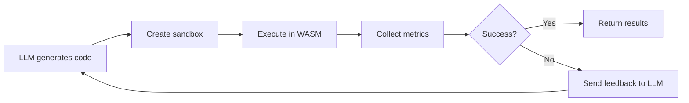

<div align="center">

# 🔒 LLM WASM Sandbox

**Production-grade security sandbox for executing untrusted Python code using WebAssembly**

[](https://www.python.org/downloads/)
[](LICENSE)
[](https://mypy-lang.org/)
[](https://github.com/astral-sh/ruff)

[Overview](#-overview) •
[Features](#-features) •
[Quick Start](#-quick-start) •
[Documentation](#-documentation) •
[Examples](#-usage-examples) •
[Security](#-security-model) •
[Contributing](#-contributing)

</div>

---

## 🎯 Overview

Run **untrusted Python code** (e.g., LLM-generated scripts) in a **WASM/WASI** sandbox with enterprise-grade isolation. This project embeds CPython compiled to WebAssembly inside a Python host using **Wasmtime**, providing deterministic execution limits, capability-based filesystem access, and comprehensive security boundaries.

### Why WASM/WASI?

| Feature | Benefit |
|---------|---------|
| 🛡️ **Memory Safety** | WebAssembly provides bounds-checked memory and validated control flow |
| 🔐 **Capability-Based I/O** | WASI uses preopens for least-privilege filesystem access |
| ⏱️ **Deterministic Limits** | Fuel system enforces instruction budgets with OutOfFuel traps |
| 📦 **Sandboxed Stdlib** | Full Python standard library without host access |
| 🔌 **No Network Access** | Zero network capabilities by default |

### What's Included

```diff
+ ✅ File I/O in isolated workspace directory
+ ✅ SQLite database support (sqlite3)
+ ✅ Full Python stdlib (JSON, CSV, regex, collections, etc.)
+ ✅ Vendored pure-Python packages
+ ✅ Session management for multi-turn LLM interactions
+ ✅ Type-safe API with Pydantic models
+ ✅ Structured logging and observability
+ ✅ Configurable resource limits (fuel, memory, output caps)
- ❌ No network access (by design)
- ❌ No subprocess execution
- ❌ No C-extension packages (numpy, pandas, etc.)
```

---

## ✨ Features

### 🔒 Security First
- **WASM Isolation** - Memory-safe execution with bounds checking
- **Capability-Based I/O** - Explicit filesystem grants via WASI preopens
- **Fuel Metering** - Deterministic CPU limits prevent infinite loops
- **Zero Network** - No socket access by design
- **Environment Hardening** - Whitelisted environment variables only

### 🚀 Production Ready
- **Type-Safe API** - Full Pydantic validation for policies and results
- **Session Management** - Persistent workspaces for multi-turn interactions
- **Structured Logging** - Built-in observability with structured events
- **Resource Limits** - Configurable fuel, memory, and output caps
- **Error Handling** - Graceful failure with detailed diagnostics

### 💡 Developer Friendly
- **Simple API** - Create sandbox and execute code in 3 lines
- **Rich Stdlib** - Full Python standard library support
- **Vendored Packages** - Easy integration of pure-Python dependencies
- **SQLite Support** - Database operations out of the box
- **Comprehensive Tests** - Security boundary validation included

### 🤖 LLM Optimized
- **Fast Feedback** - Quick execution metrics for LLM training loops
- **Code Isolation** - Safe execution of untrusted generated code
- **Multi-Turn Sessions** - Stateful interactions with file persistence
- **Flexible Limits** - Tune resource budgets per use case

---

## 🚀 Quick Start

### Prerequisites

- **Python 3.11+**
- **[uv](https://docs.astral.sh/uv/)** (recommended) or pip

### Installation

<details>
<summary><b>Option 1: Using uv (Recommended)</b></summary>

```powershell
# Install uv (once per machine)
powershell -c "irm https://astral.sh/uv/install.ps1 | iex"

# Clone and setup
git clone https://github.danskenet.net/e29667/llm-wasm-sandbox.git
cd llm-wasm-sandbox

# Install dependencies and create venv
uv sync

# Download CPython WASM binary (~50-100 MB)
.\scripts\fetch_wlr_python.ps1

# Verify installation
uv run python -c "from sandbox import create_sandbox, RuntimeType; sandbox = create_sandbox(runtime=RuntimeType.PYTHON); print(sandbox.execute('print(42)').stdout)"
```

</details>

<details>
<summary><b>Option 2: Using pip</b></summary>

```powershell
# Clone repository
git clone https://github.danskenet.net/e29667/llm-wasm-sandbox.git
cd llm-wasm-sandbox

# Create virtual environment
python -m venv .venv
.\.venv\Scripts\Activate.ps1

# Install dependencies
pip install -r requirements.txt

# Download CPython WASM binary
.\scripts\fetch_wlr_python.ps1

# Verify installation
python -c "from sandbox import create_sandbox, RuntimeType; sandbox = create_sandbox(runtime=RuntimeType.PYTHON); print(sandbox.execute('print(42)').stdout)"
```

</details>

### Your First Sandbox

```python
from sandbox import create_sandbox, RuntimeType

# Create a sandbox with default security settings
sandbox = create_sandbox(runtime=RuntimeType.PYTHON)

# Execute untrusted code safely
result = sandbox.execute("""
print("Hello from WebAssembly!")
print("This code runs in complete isolation")
""")

# Access typed results
print(result.stdout)
print(f"Fuel consumed: {result.fuel_consumed:,}")
print(f"Success: {result.success}")
```

### Run the Demo

```powershell
# Comprehensive demo with rich console output
uv run python demo.py

# Run test suite
uv run pytest tests/ -v
```

---

## 📚 Documentation

### Creating a Sandbox

```python
from sandbox import create_sandbox, RuntimeType, ExecutionPolicy

# Basic sandbox with defaults
sandbox = create_sandbox(runtime=RuntimeType.PYTHON)

# Custom policy with validation
policy = ExecutionPolicy(
    fuel_budget=1_000_000_000,      # 1B instructions
    memory_bytes=64 * 1024 * 1024,  # 64 MB
    stdout_max_bytes=1_000_000,     # 1 MB output cap
    env={"API_KEY": "secret"}       # Environment whitelist
)
sandbox = create_sandbox(runtime=RuntimeType.PYTHON, policy=policy)
```

### Executing Code

```python
# Execute with typed results
result = sandbox.execute("""
import json
data = {"status": "success", "value": 42}
print(json.dumps(data))
""")

# Access result fields (all type-safe)
print(result.stdout)              # Standard output
print(result.success)             # Execution succeeded?
print(result.fuel_consumed)       # Fuel units used
print(result.duration_seconds)    # Wall-clock time
```

---

## ⚙️ Resource Limits & Configuration

Execution policies are configured using the type-safe `ExecutionPolicy` Pydantic model with automatic validation:

### Policy Configuration

```python
from sandbox import create_sandbox, ExecutionPolicy, RuntimeType

policy = ExecutionPolicy(
    fuel_budget=2_000_000_000,       # Instruction limit (default: 2B)
    memory_bytes=128_000_000,        # Memory cap (default: 128MB)
    stdout_max_bytes=2_000_000,      # Stdout limit (default: 2MB)
    stderr_max_bytes=1_000_000,      # Stderr limit (default: 1MB)
    mount_host_dir="workspace",       # Host directory to mount
    guest_mount_path="/app",         # Guest mount point
    env={"CUSTOM_VAR": "value"},     # Environment whitelist
    argv=["python", "-I", "/app/user_code.py", "-X", "utf8"]
)

sandbox = create_sandbox(runtime=RuntimeType.PYTHON, policy=policy)
```

### Default Limits

| Resource | Default Value | Description |
|----------|---------------|-------------|
| **Fuel Budget** | 2,000,000,000 | Maximum instruction count before OutOfFuel trap |
| **Memory** | 128 MB | WASM linear memory cap |
| **Stdout** | 2 MB | Maximum stdout capture size |
| **Stderr** | 1 MB | Maximum stderr capture size |
| **Filesystem** | `/app` only | Isolated workspace directory |
| **Environment** | Whitelist only | Explicit variable approval required |

### Loading from TOML

```python
from sandbox import load_policy
from pathlib import Path

# Load from config/policy.toml
policy = load_policy(Path("config/policy.toml"))
sandbox = create_sandbox(runtime=RuntimeType.PYTHON, policy=policy)
```

---

## ✅ Capabilities & Limitations

<table>
<tr>
<td width="50%">

### ✅ Supported Features

- ✅ **File I/O** under `/app` (and `/data` if configured)
- ✅ **SQLite** databases via `sqlite3` module
- ✅ **JSON/CSV** parsing and generation
- ✅ **Regular expressions** (`re` module)
- ✅ **Data structures** (collections, heapq, itertools)
- ✅ **Text processing** (string, codecs, unicodedata)
- ✅ **Math & statistics** (math, statistics, decimal)
- ✅ **Date/time** (datetime, time, calendar)
- ✅ **Vendored packages** (pure-Python only)

</td>
<td width="50%">

### ❌ Limitations

- ❌ **No network access** (no sockets by design)
- ❌ **No subprocess** execution
- ❌ **No files outside** preopened directories
- ❌ **No C extensions** (numpy, pandas, pillow, etc.)
- ❌ **No unbounded loops** (fuel limit enforced)
- ❌ **No OS commands** (no system calls)
- ❌ **No threading** (single-threaded WASM)
- ❌ **No dynamic loading** (all imports must be bundled)

</td>
</tr>
</table>

---

## 📦 Vendoring Dependencies

Pure-Python packages can be vendored and made available to sandboxed code.

### Managing Vendored Packages

```powershell
# Bootstrap recommended packages (certifi, charset-normalizer, idna, urllib3)
uv run python scripts/manage_vendor.py bootstrap

# Install additional pure-Python package
uv run python scripts/manage_vendor.py install requests

# Copy to workspace for sandbox access
uv run python scripts/manage_vendor.py copy

# List installed packages
uv run python scripts/manage_vendor.py list

# Clean vendor directory
uv run python scripts/manage_vendor.py clean
```

### Using Vendored Packages

```python
from sandbox import create_sandbox, RuntimeType

sandbox = create_sandbox(runtime=RuntimeType.PYTHON)

result = sandbox.execute("""
import sys
sys.path.insert(0, '/app/site-packages')

# Now vendored packages are available
import certifi
import urllib3

print(f"certifi version: {certifi.__version__}")
print(f"CA bundle: {certifi.where()}")
""")

print(result.stdout)
```

**Note:** Only **pure-Python** packages are supported. Packages with C extensions (numpy, pandas, etc.) cannot be used in the WASM environment.

---

## 🔧 Helper Scripts

### Fetch WASM Binary

```powershell
# Windows (PowerShell)
.\scripts\fetch_wlr_python.ps1

# Unix/Linux/MacOS (Bash)
./scripts/fetch_wlr_python.sh
```

Downloads the CPython WASM binary from WebAssembly Language Runtimes (WLR) releases and saves it to `bin/python.wasm`. To update to a newer Python version, edit the `$WLR_RELEASE_TAG` and `$AIO_FILE` variables in the script.

### Manage Vendored Packages

```powershell
# Bootstrap recommended packages
uv run python scripts/manage_vendor.py bootstrap

# Install specific package
uv run python scripts/manage_vendor.py install <package-name>

# Copy to workspace
uv run python scripts/manage_vendor.py copy

# List installed
uv run python scripts/manage_vendor.py list

# Clean vendor directory
uv run python scripts/manage_vendor.py clean
```

---

## 📜 Project Structure

```text
llm-wasm-sandbox/
├── bin/
│   └── python.wasm              # CPython compiled to WASM (WLR binary)
├── config/
│   └── policy.toml              # Default execution policy
├── sandbox/                     # Core sandbox implementation
│   ├── core/                    # Type-safe foundation (NEW)
│   │   ├── models.py            # ExecutionPolicy, SandboxResult, RuntimeType
│   │   ├── base.py              # BaseSandbox abstract interface
│   │   ├── errors.py            # Custom exceptions
│   │   ├── logging.py           # Structured event logging
│   │   └── factory.py           # create_sandbox() factory
│   ├── runtimes/                # Runtime implementations (NEW)
│   │   └── python/
│   │       └── sandbox.py       # PythonSandbox(BaseSandbox)
│   ├── host.py                  # Wasmtime + WASI configuration
│   ├── policies.py              # Policy loading utilities
│   ├── sessions.py              # Session management
│   ├── utils.py                 # Helper functions
│   └── vendor.py                # Dependency vendoring
├── scripts/
│   ├── fetch_wlr_python.ps1     # Download WASM binary (Windows)
│   ├── fetch_wlr_python.sh      # Download WASM binary (Unix)
│   └── manage_vendor.py         # Vendor package management CLI
├── tests/                       # Comprehensive test suite
│   ├── test_core_models.py      # Type validation tests
│   ├── test_python_sandbox.py   # Sandbox execution tests
│   ├── test_session_*.py        # Session management tests
│   └── test_security.py         # Security boundary tests
├── workspace/                   # Isolated filesystem (mounted as /app)
│   └── <session-id>/            # Per-session workspaces
├── vendor/                      # Vendored pure-Python packages
│   └── site-packages/
├── demo.py                      # Comprehensive feature demo
├── pyproject.toml               # Project metadata & dependencies
└── README.md                    # This file
```

---

## 🤖 LLM Integration

### Integration Flow

Typical usage in an LLM code generation pipeline:



### Example Integration

```python
from sandbox import create_sandbox, ExecutionPolicy, RuntimeType

def execute_llm_code(llm_generated_code: str) -> dict:
    """Execute LLM-generated code with safety boundaries."""
    
    # Configure conservative limits for LLM code
    policy = ExecutionPolicy(
        fuel_budget=500_000_000,      # Fail fast on complex code
        memory_bytes=32 * 1024 * 1024,  # 32 MB limit
        stdout_max_bytes=100_000        # 100 KB output
    )
    
    sandbox = create_sandbox(runtime=RuntimeType.PYTHON, policy=policy)
    result = sandbox.execute(llm_generated_code)
    
    # Provide structured feedback for LLM
    if not result.success:
        return {
            "status": "error",
            "feedback": f"Execution failed: {result.stderr}",
            "suggestion": "Simplify the code and avoid complex operations"
        }
    
    if result.fuel_consumed > 400_000_000:
        return {
            "status": "warning",
            "feedback": "Code complexity too high",
            "fuel_used": result.fuel_consumed,
            "suggestion": "Optimize algorithm for better efficiency"
        }
    
    return {
        "status": "success",
        "output": result.stdout,
        "metrics": {
            "fuel": result.fuel_consumed,
            "duration": result.duration_seconds,
            "memory_pages": result.mem_pages
        }
    }

# Use in LLM loop
code = generate_code_from_llm("Calculate fibonacci(10)")
feedback = execute_llm_code(code)
print(feedback)
```

### Multi-Turn Sessions

For stateful LLM interactions with file persistence:

```python
from sandbox import create_sandbox, RuntimeType

# Turn 1: LLM creates data file
sandbox = create_sandbox(runtime=RuntimeType.PYTHON)
session_id = sandbox.session_id

result1 = sandbox.execute("""
import json
data = {"users": ["Alice", "Bob"], "count": 2}
with open('/app/data.json', 'w') as f:
    json.dump(data, f)
print("Data saved")
""")

# Turn 2: LLM reads and processes data (same session)
sandbox = create_sandbox(session_id=session_id, runtime=RuntimeType.PYTHON)

result2 = sandbox.execute("""
import json
with open('/app/data.json', 'r') as f:
    data = json.load(f)
data['users'].append('Charlie')
data['count'] = len(data['users'])
print(f"Updated: {data}")
""")

print(result2.stdout)  # "Updated: {'users': ['Alice', 'Bob', 'Charlie'], 'count': 3}"
```

---

## 🔒 Security Model

### Multi-Layered Defense

This sandbox implements defense-in-depth with multiple security boundaries:

#### 1. **WASM Memory Safety**
- Bounds-checked linear memory (no buffer overflows)
- Validated control flow (no arbitrary jumps)
- Type-safe execution (strong typing enforced)

#### 2. **WASI Capability-Based I/O**
- **Preopens only**: File access limited to explicitly granted directories
- **No path traversal**: `..` and absolute paths outside capabilities are denied
- **Descriptor-based**: All I/O goes through validated capability descriptors

#### 3. **Deterministic Execution Limits**
- **Fuel metering**: Instruction-count budgets enforce hard time limits
- **OutOfFuel trap**: Exhausted budget triggers immediate termination
- **No runaway loops**: Infinite loops hit fuel limit automatically

#### 4. **Resource Caps**
- **Memory limit**: WASM linear memory capped at configured size
- **Output limits**: Stdout/stderr truncated to prevent DoS
- **No networking**: Zero network capabilities (no sockets)
- **No subprocesses**: Cannot spawn child processes

### Security Boundaries

| Boundary | Mechanism | Protection |
|----------|-----------|------------|
| **Memory** | WASM bounds checking | Prevents buffer overflows, use-after-free |
| **Filesystem** | WASI preopens | Restricts access to mounted directories only |
| **CPU** | Fuel metering | Prevents infinite loops, excessive computation |
| **I/O** | Capability descriptors | No ambient authority, explicit grants |
| **Environment** | Variable whitelist | Prevents info leaks, credentials exposure |

### Production Hardening

For production deployments, combine with OS-level security:

```python
import subprocess
import signal
from pathlib import Path

def execute_with_timeout(code: str, timeout_seconds: int = 30):
    """Execute sandbox in separate process with OS timeout."""
    
    script = f"""
from sandbox import create_sandbox, RuntimeType
sandbox = create_sandbox(runtime=RuntimeType.PYTHON)
result = sandbox.execute({code!r})
print(result.stdout)
"""
    
    try:
        result = subprocess.run(
            ["python", "-c", script],
            timeout=timeout_seconds,
            capture_output=True,
            text=True
        )
        return result.stdout
    except subprocess.TimeoutExpired:
        return "Execution timeout (OS limit)"
```

### Additional Recommendations

- 🐳 **Containers**: Run sandbox in Docker/Podman for additional isolation
- 📦 **cgroups**: Use Linux cgroups for CPU/memory limits
- 📊 **Monitoring**: Log all executions with code hashes for audit trails
- ⏱️ **OS Timeouts**: Combine fuel limits with OS-level process timeouts
- 🔐 **Network Isolation**: Deploy in network-restricted environments

---

## 🔧 Troubleshooting

### Common Issues

<details>
<summary><b>🚨 <code>python.wasm not found</code></b></summary>

**Solution:** Download the WASM binary
```powershell
.\scripts\fetch_wlr_python.ps1
```

**Verify:** Check that `bin/python.wasm` exists and is ~50-100 MB

</details>

<details>
<summary><b>🚨 <code>ImportError: wasmtime could not be imported</code></b></summary>

**Solution:** Install dependencies
```powershell
uv sync
# OR
pip install -r requirements.txt
```

**Verify:** `python -c "import wasmtime; print(wasmtime.__version__)"`

</details>

<details>
<summary><b>🚨 <code>OutOfFuel</code> trap during execution</b></summary>

**Cause:** Code exceeded instruction budget

**Solution:** Increase fuel budget or simplify code
```python
policy = ExecutionPolicy(fuel_budget=5_000_000_000)  # Increase limit
sandbox = create_sandbox(runtime=RuntimeType.PYTHON, policy=policy)
```

</details>

<details>
<summary><b>🚨 Memory limit errors</b></summary>

**Cause:** WASM memory cap exceeded

**Solution:** Increase memory limit
```python
policy = ExecutionPolicy(memory_bytes=256 * 1024 * 1024)  # 256 MB
sandbox = create_sandbox(runtime=RuntimeType.PYTHON, policy=policy)
```

</details>

<details>
<summary><b>🚨 <code>FileNotFoundError</code> in guest code</b></summary>

**Cause:** Path outside preopened directories

**Solution:** Use `/app` prefix for all file operations
```python
# ❌ Wrong
open('data.txt', 'r')

# ✅ Correct
open('/app/data.txt', 'r')
```

</details>

<details>
<summary><b>🚨 <code>ModuleNotFoundError</code> for package</b></summary>

**Cause:** Package not vendored or not in sys.path

**Solution:** Vendor pure-Python package
```powershell
uv run python scripts/manage_vendor.py install <package-name>
uv run python scripts/manage_vendor.py copy
```

Then in sandboxed code:
```python
import sys
sys.path.insert(0, '/app/site-packages')
import <package-name>
```

</details>

### Getting Help

- 🐞 **Report bugs**: [GitHub Issues](https://github.danskenet.net/e29667/llm-wasm-sandbox/issues)
- 📖 **Documentation**: See inline code comments and docstrings
- 💡 **Examples**: Check `demo.py` and `tests/` directory

---

## 🛠️ Development

### Running Tests

```powershell
# Run all tests with coverage
uv run pytest tests/ -v --cov=sandbox --cov-report=html

# Run specific test file
uv run pytest tests/test_python_sandbox.py -v

# Run tests matching pattern
uv run pytest tests/ -k "session" -v
```

### Code Quality

```powershell
# Type checking
uv run mypy sandbox/

# Linting and formatting
uv run ruff check sandbox/
uv run ruff format sandbox/
```

### Benchmarking

```powershell
# Performance benchmarks
uv run python benchmark_performance.py

# Session performance
uv run python benchmark_session_performance.py
```

---

## 🤝 Contributing

Contributions are welcome! Please follow these guidelines:

1. **Fork** the repository
2. **Create** a feature branch (`git checkout -b feature/amazing-feature`)
3. **Commit** your changes (`git commit -m 'Add amazing feature'`)
4. **Push** to the branch (`git push origin feature/amazing-feature`)
5. **Open** a Pull Request

### Development Setup

```powershell
# Clone your fork
git clone https://github.danskenet.net/YOUR-USERNAME/llm-wasm-sandbox.git
cd llm-wasm-sandbox

# Install dev dependencies
uv sync

# Run tests to verify setup
uv run pytest tests/ -v
```

---

## 📝 License

This project is licensed under the MIT License - see the [LICENSE](LICENSE) file for details.

---

## 🔗 References & Resources

- **Wasmtime Security**: https://docs.wasmtime.dev/security.html
- **WASI Capabilities**: https://github.com/bytecodealliance/wasmtime/blob/main/docs/WASI-capabilities.md
- **WebAssembly Language Runtimes**: https://github.com/webassemblylabs/webassembly-language-runtimes
- **Wasmtime Python Bindings**: https://github.com/bytecodealliance/wasmtime-py
- **WASI Specification**: https://github.com/WebAssembly/WASI

---

## 🚀 Roadmap

- [ ] JavaScript runtime support
- [ ] Improved async execution support
- [ ] Network sandboxing with explicit socket grants
- [ ] Enhanced metrics and profiling
- [ ] Plugin system for custom runtimes
- [ ] Web-based demo interface

---

## ⭐ Star History

If you find this project useful, please consider giving it a star on GitHub!

---

<div align="center">

**Built with ❤️ for secure LLM code execution**

[Report Bug](https://github.danskenet.net/e29667/llm-wasm-sandbox/issues) •
[Request Feature](https://github.danskenet.net/e29667/llm-wasm-sandbox/issues) •
[Documentation](https://github.danskenet.net/e29667/llm-wasm-sandbox)

</div>
